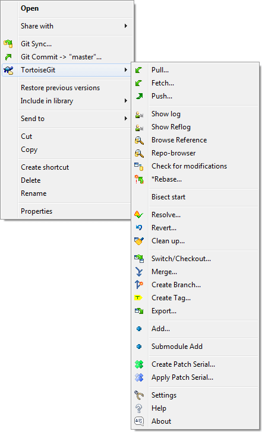
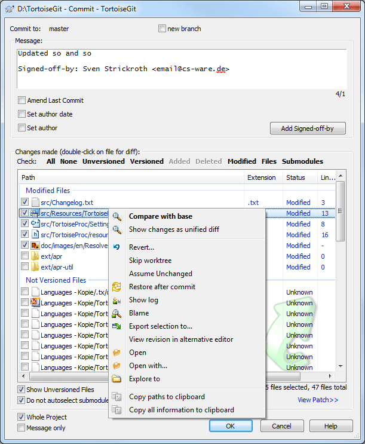

git-howto
=========

# tortoisegit – 使用 git 的图形化客户端 #

git是一个分布式代码库管理工具，是继sourcesafe, cvs, clearcase, svn 之后的最佳选择。

至于git和其他工具相比有什么优点，不用我赘述，随便Google一下，都可能看到诸多的文章来说明。

不过，很多最开始使用git的时候，都会觉得命令行的使用，是个麻烦的事情。当然，习惯了就好了。采用任何新的工具，接触任何新的事物，都有一个学习曲线需要克服。

那么，对于习惯了使用svn的人来说，有没有更简单的办法呢？

有。

大部分使用svn的人，尤其是在windows下使用，都是使用tortoiseSVN，和资源管理器集成，然后通过右键弹出菜单，来更新和提交文件。

幸运的是，TortoiseSVN有一个双胞胎弟弟，叫TortoiseGit。说它是双胞胎弟弟，是因为它的界面和TortoiseSVN基本上一样。

右键弹出菜单：

提交界面：

官网：https://code.google.com/p/tortoisegit/

下载页面：https://code.google.com/p/tortoisegit/wiki/Download

需要：Git for Windows 1.7.10 or above is also required for TortoiseGit (recommended order: install TortoiseGit first).

如果是在天朝，几乎所有的google.com 都被伟(wan)大(e)的防火长城墙掉了，可以[下载这里的镜像版本（包括语言包）](windows/)。

根据你的机器是32位还是64位，选择相应的版本。安装顺序：

1、TortoiseGit 及 语言包。

2、Git for Windows （也叫做msysgit）

 

